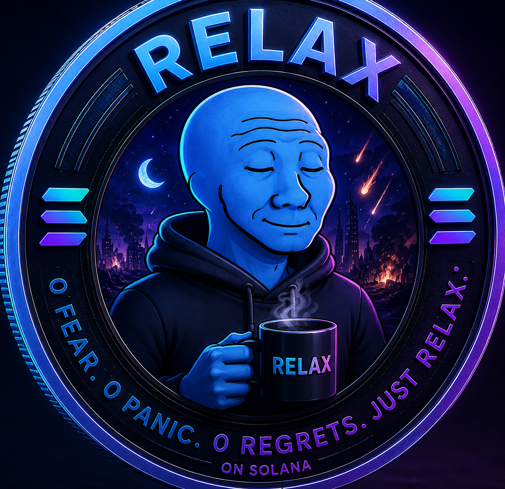

<div align="center">



<h1>RELAX</h1>

<strong>Not another memecoin. A mindset.</strong>

<p>0 Fear. 0 Panic. 0 Regrets. Just RELAX</p>

<p>
<a href="https://0relaxbro.xyz">Website</a> ·
<a href="https://x.com/0relaxbro">X</a> ·
<a href="https://www.youtube.com/@0relaxbro">YouTube</a> ·
<a href="https://pump.fun/coin/6DDJ6Gsuvhe4Hb7zkohLBhDjKkyCxHsYt4thNukbpump">Pump.fun</a> ·
<a href="https://dexscreener.com/solana/5ztferjiljz3u4kzkwmguyujxcwkpagzfqwwyja7yzx3">DexScreener</a>
</p>

</div>

---

## What is RELAX

RELAX is a Solana-based community token built around one simple idea:
markets are chaotic, but your decisions don't have to be.

The story: RELAX survived it — not by ignoring the risk, but by
already pricing it in. He was there when the world ended, and made it
through when others gave up. Now he's here to share that calm, not
advice.

No fake utility. No empty promises. No manufactured hype. Just a
philosophy, a public codebase, and a token you can verify yourself.

**Built in public.** This entire site — code, design, and features — is
open for anyone to read, question, or fork.

## The Contract

```
6DDJ6Gsuvhe4Hb7zkohLBhDjKkyCxHsYt4thNukbpump
```

Always verify the contract address independently before interacting
with any token. Never trust a slogan — check the chain.

- Fixed supply, no additional minting
- No private creator allocation
- Public, on-chain verifiable

## What's in this repo

This is the full source of [0relaxbro.xyz](https://0relaxbro.xyz) — a
single-file static site (`index.html`), no build step, no framework,
hosted on GitHub Pages.

| File | What it is |
|---|---|
| `index.html` | The main site |
| `score.html` | RELAX Score — an experimental, free, live tool that reads a public Solana wallet's recent on-chain activity and estimates a FOMO / Panic / RELAX read. No wallet connection, no signing, no cost. |
| `404.html` | Custom not-found page |
| `manifest.json` | PWA metadata (favicons, add-to-home-screen) |

## RELAX Score (Experiment 001)

Our first experiment: can public on-chain behavior reveal something
about FOMO and panic patterns? `score.html` reads up to 30 days of a
wallet's transaction history directly from Solana's public network,
proxied through a Cloudflare Worker with a method allowlist — no API
key ever touches the client, no backend database, no data stored
anywhere.

It surfaces five signals: FOMO Signal, Panic Signal, RELAX Score,
estimated wallet age, and average token holding time — all derived
from transaction patterns, not price history.

It's a heuristic, not financial analysis. It can be wrong. It's
labeled as an experiment because it is one.

## Philosophy

- **Observe.** Watch the market without reacting to every candle.
- **Build.** Ship things that are actually ready, not announced early.
- **Experiment.** Test ideas in the open. Some will work. Some won't.
- **Evolve.** No fixed roadmap with fake dates — just honest iteration.

## Not financial advice

RELAX is a community token, not an investment vehicle. Crypto assets
are volatile and carry real risk. Always do your own research and
verify the contract before making any decision.

---

<div align="center">

<strong>Just RELAX Bro.</strong>

</div>
